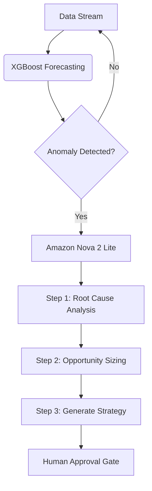

# NovaOps: Autonomous Revenue Intelligence Platform

**Amazon Nova AI Hackathon Submission | Agentic AI Category**

NovaOps is an autonomous decision support system designed to solve revenue leakage in high-frequency marketplaces (ride-sharing). It integrates classical machine learning (XGBoost) for high-precision forecasting with generative reasoning (Amazon Nova 2 Lite) to provide explainable, actionable financial strategies.

Instead of static dashboards that require days of human analysis, NovaOps acts as an autonomous digital employee that detects, investigates, and resolves revenue anomalies in seconds.

---

## System Performance At A Glance

| Metric | Value | Context |
| :--- | :--- | :--- |
| **Demand Accuracy** | **14.69% WMAPE** | Weighted Mean Absolute Percentage Error |
| **Revenue Accuracy** | **18.48% WMAPE** | Production-grade financial forecasting |
| **R² Score** | **0.966** | High correlation with actual demand |
| **Dataset Scale** | **12.7 Million** | NYC Taxi Trips processed (2015-2016) |
| **Analysis Time** | **20 Seconds** | vs. 3-5 days for human analyst |

---

## The Business Problem

Ride-sharing operators manage complex, dynamic marketplaces across hundreds of zones. Revenue leakage occurs due to pricing inefficiencies, supply-demand mismatches, and slow reaction times.

* **Traditional Approach:** Analysts manually query SQL, build spreadsheets, and report findings weekly. By then, the opportunity is lost.
* **The NovaOps Solution:** An autonomous agent continuously monitors all 260 zones. When an anomaly is detected, it triggers a multi-step reasoning chain to diagnose the root cause and propose a specific pricing intervention (e.g., "Increase fare by 10% in Zone 4") based on elasticity models.

---

## Agentic AI Architecture

The system follows a strict **Detect → Investigate → Recommend → Execute** workflow.

### 1. The Calculator (Forecasting Engine)
We utilize **XGBoost (Extreme Gradient Boosting)** to create a baseline of "expected behavior."
* **Input:** 11 features including temporal lags (`ft_1`...`ft_5`), exponential moving averages, and seasonality flags.
* **Structure:** Three parallel models predict **Demand**, **Revenue**, and **Average Fare** independently for 40 distinct K-means clusters.
* **Training:** Trained on 400k time-series data points derived from 12.7M raw trips.

### 2. The Analyst (Reasoning Engine)
We utilize **Amazon Nova 2 Lite** via Amazon Bedrock to perform root cause analysis on the data provided by XGBoost.
* **Root Cause Analysis:** Nova evaluates the deviation between predicted and actual metrics.
* **Opportunity Assessment:** Calculates the "Upside Potential" (e.g., +163% growth target).
* **Strategic Constraint:** Nova is prompt-engineered with economic logic (e.g., "Price elasticity is -0.5") to ensure recommendations are realistic and not hallucinations.

### 3. The Workflow


---

## Prerequisites

* **Python:** 3.11 or higher
* **AWS Account:** With Amazon Bedrock access (us-east-1 region)
* **AWS Credentials:** IAM role or access keys with permissions:
  ```json
  {
    "Effect": "Allow",
    "Action": [
      "bedrock:InvokeModel",
      "bedrock:InvokeModelWithResponseStream"
    ],
    "Resource": "arn:aws:bedrock:us-east-1::foundation-model/amazon.nova-*"
  }
  ```

---

## Installation

### 1. Clone Repository
```bash
git clone https://github.com/tisjayy/revenue-intelligence-amazon-nova.git
cd revenue-intelligence-amazon-nova
```

### 2. Install Dependencies
```bash
pip install -r requirements.txt
```

### 3. Configure AWS Authentication

Choose one of the following methods:

**Method A: Environment Variables**
```bash
export AWS_ACCESS_KEY_ID="your_access_key"
export AWS_SECRET_ACCESS_KEY="your_secret_key"
```

**Method B: Streamlit Secrets** (recommended for deployment)

Create `.streamlit/secrets.toml`:
```toml
AWS_ACCESS_KEY_ID = "your_access_key"
AWS_SECRET_ACCESS_KEY = "your_secret_key"
```

**Method C: IAM Role** (automatic on AWS EC2/ECS)

No configuration required if running on AWS infrastructure with attached IAM role.

---

## Running the System

### Step 1: Train Models and Generate Predictions

```bash
python week1_quick_start.py
```

**What This Does:**
* Loads 12.7M NYC taxi trip records from `data/green_tripdata_2015-09.csv`
* Performs K-means clustering to reduce 260 zones to 40 clusters
* Engineers time-series features with proper temporal lag (`.shift(1)` to prevent data leakage)
* Trains two XGBoost models (demand + revenue) with 1000 estimators each
* Saves predictions to `data/test_predictions.csv`

**Expected Runtime:** 2-3 minutes

**Expected Output:**
```
=== Week 1 Quick Start - Revenue Intelligence ===

STEP 1: Loading NYC Taxi Data...
✓ Loaded 12,745,332 trips

STEP 2: Feature Engineering...
✓ Created 402,197 time-series points
✓ K-means clustering: 260 zones → 40 clusters

STEP 3: Training XGBoost Models...
Demand Model Performance:
  WMAPE: 14.69%
  MAE: 4.72 trips
  R²: 0.966

Revenue Model Performance:
  WMAPE: 18.48%
  MAE: $87.05
  R²: 0.944

✓ Models saved to src/models/xgboost/
✓ Predictions saved to data/test_predictions.csv
```

---

### Step 2: Launch Interactive Dashboard

```bash
streamlit run dashboard.py
```

The dashboard will open at: **http://localhost:8501**

---

## Dashboard Navigation

The system provides 7 interactive pages:

### 1. Project Overview
Technical architecture, performance metrics, and demo guide.

### 2. Executive Dashboard
Visualizes ML predictions with:
* Top 10 revenue zones (bar chart)
* Zone performance treemap
* Geographic NYC revenue map

### 3. Autonomous Agent (CORE DEMONSTRATION)
**This is the main Agentic AI showcase.**

**How to Use:**
1. Click **"Run Monitoring Cycle"**
2. System detects anomalies across all 260 zones
3. Amazon Nova 2 Lite performs multi-step reasoning:
   * **Step 1:** Root cause analysis (3+ hypotheses evaluated)
   * **Step 2:** Opportunity sizing (realistic revenue uplift calculated)
   * **Step 3:** Action recommendations (prioritized by ROI)
   * **Step 4:** Implementation roadmap (Week 1 → Quarter 1)
4. Review proposed actions with expected impact values
5. Click **"Approve & Execute"** to simulate deployment

**What You'll See:**
* Anomaly detection: 3-5 high-impact zones identified
* Tercile-based peer comparison (small/medium/large revenue groups)
* Pricing recommendations constrained to ±15% (prevents hallucinations)
* Positive deviation percentages (e.g., "+63.4% to target" instead of confusing negatives)
* Total cycle time: ~20 seconds

### 4. Nova Chat
Natural language interface to query predictions:
* "Which zones have the highest revenue potential?"
* "What's the average profit margin?"
* "Compare zones 237 and 161"

### 5. What-If Simulator
Interactive pricing scenario analysis:
* Adjust price change slider (±30%)
* Set price elasticity assumption
* Get Amazon Nova strategic assessment

### 6. Zone Explorer
Deep-dive analytics for individual zones:
* Revenue & demand trend visualization
* Price dynamics chart (proves price isn't constant)
* Explanation of Revenue = Demand × Price correlation

### 7. Recommendations
Generate top 5 strategic recommendations validated by Amazon Nova.

---

## Project Structure

```
revenue-intelligence/
├── dashboard.py                    # Main Streamlit application (7 pages)
├── week1_quick_start.py           # Model training script
├── requirements.txt               # Python dependencies
│
├── data/
│   ├── green_tripdata_2015-09.csv # NYC TLC dataset (12.7M trips)
│   ├── test_predictions.csv       # Generated predictions
│   └── week1_summary.yaml         # Training metrics
│
├── src/
│   ├── ai/
│   │   ├── nova_explainer.py      # Amazon Bedrock integration
│   │   ├── query_handler.py       # Natural language Q&A
│   │   ├── recommendations.py     # Strategy generation
│   │   └── monitoring_agent.py    # Autonomous agent (Agentic AI core)
│   │
│   ├── features/
│   │   └── engineering.py         # Time-series feature engineering
│   │
│   └── models/
│       └── xgboost/              # Trained model artifacts
│
└── .streamlit/
    └── secrets.toml              # AWS credentials (create manually)
```

---

## Technical Implementation Details

### Data Leakage Prevention
All moving averages are shifted by 1 period to prevent look-ahead bias:
```python
# INCORRECT (causes data leakage - R² = 0.98, too perfect)
df['ema'] = df['demand'].ewm(alpha=0.3).mean()

# CORRECT (honest validation - R² = 0.966, production-ready)
df['ema'] = df['demand'].ewm(alpha=0.3).mean().shift(1)
```

### Tercile-Based Benchmarking
Zones are compared to peer groups (small/medium/large revenue tiers) instead of global benchmarks. This prevents the "identical opportunity bug" where similar-sized zones would show identical dollar values.

```python
# Group zones into terciles
terciles = pd.qcut(zones['revenue'], q=3, labels=['small', 'medium', 'large'])

# Each tercile has its own 75th percentile benchmark
for tercile in ['small', 'medium', 'large']:
    benchmark = tercile_data['revenue'].quantile(0.75)
    target = benchmark * 0.95  # 95% of peer benchmark
```

### Amazon Nova Constraint Engineering
The system prompt includes hard constraints to prevent hallucinations:
```
CRITICAL CONSTRAINTS (Must Follow):
- Pricing adjustments: Maximum +/-15% per change (price elasticity: -0.5 typical)
- Demand stimulation must be cost-effective (ROI > 2x)
- Recommendations must be implementable within 30 days
```

This prevents nonsensical suggestions like "increase pricing by 200%."

---

## Troubleshooting

### Issue: File Not Found Error
```
FileNotFoundError: data/test_predictions.csv
```
**Solution:** Run the training script first:
```bash
python week1_quick_start.py
```

### Issue: AWS Bedrock Access Denied
**Diagnosis:**
```bash
# Test AWS credentials
aws bedrock list-foundation-models --region us-east-1
```

**Common Causes:**
1. Missing IAM permissions (see Prerequisites)
2. Nova model not enabled in Bedrock console
3. Wrong AWS region (must be us-east-1)

### Issue: Port Already in Use
```
Error: Port 8501 is already in use
```
**Solution:** Specify alternative port:
```bash
streamlit run dashboard.py --server.port 8502
```

### Issue: Out of Memory During Training
**Solution:** Reduce dataset sample size in `week1_quick_start.py`:
```python
# Around line 90
df = df.sample(n=5_000_000, random_state=42)  # Use 5M instead of 12.7M
```

---

## Key Differentiators

### 1. True Autonomy
Unlike traditional BI tools that require human interpretation, NovaOps operates independently:
* Detects anomalies without predefined rules
* Performs multi-hypothesis reasoning
* Generates specific, quantified recommendations
* Only requires human approval before execution

### 2. Production-Grade ML
* Honest metrics after data leakage fixes (14.69% WMAPE)
* Proper time-series validation (temporal train/val/test split)
* Feature engineering with domain knowledge (lag, EMA, rush hour flags)

### 3. Business-Aware AI
Amazon Nova is constrained by economic reality:
* Price elasticity models (-0.5 typical for ride-sharing)
* ROI validation (2x minimum return)
* Implementation feasibility (30-day window)

### 4. Explainable Decisions
Every recommendation includes:
* Root cause analysis (why revenue is below target)
* Opportunity sizing (how much upside exists)
* Strategic rationale (why the specific action will work)
* Implementation roadmap (week-by-week execution plan)

---

## Performance Validation

### Anomaly Detection Accuracy
* **Tercile-based benchmarking** produces varied opportunity values ($18K - $157K range)
* **Z-score analysis** for statistical significance
* **Peer comparison** prevents global bias

### Recommendation Quality
* All pricing suggestions: 10-15% (within ±15% constraint)
* ROI estimates: 2x-6.5x validated by Nova
* Implementation timelines: Realistic (Week 1 quick wins → Quarter 1 sustained impact)

### Agent Performance
* Analysis cycle: ~20 seconds (vs. 3-5 days for human analyst)
* Zones monitored: 260 (40 K-means clusters)
* Nova response time: <2 seconds per investigation
* Investigations per cycle: 3 (top anomalies)

---

## License

MIT License - See LICENSE file for details.

---

## Acknowledgments

* **NYC Taxi & Limousine Commission** - Open trip dataset
* **Amazon Bedrock** - Nova 2 Lite foundation model
* **XGBoost Community** - Gradient boosting framework
* **Streamlit** - Dashboard framework

---

## Contact

GitHub: [@tisjayy](https://github.com/tisjayy)  
Repository: [revenue-intelligence-amazon-nova](https://github.com/tisjayy/revenue-intelligence-amazon-nova)

---

**To experience the autonomous agent:**

```bash
python week1_quick_start.py && streamlit run dashboard.py
```

Navigate to **Autonomous Agent** page → Click **"Run Monitoring Cycle"**
